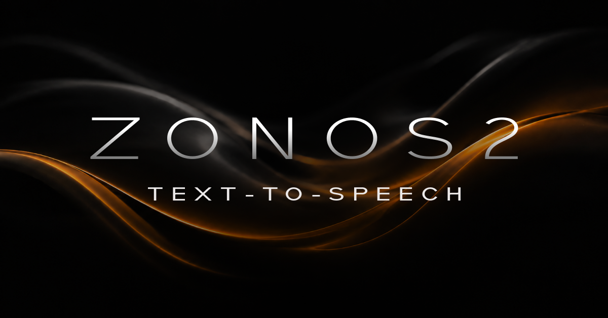
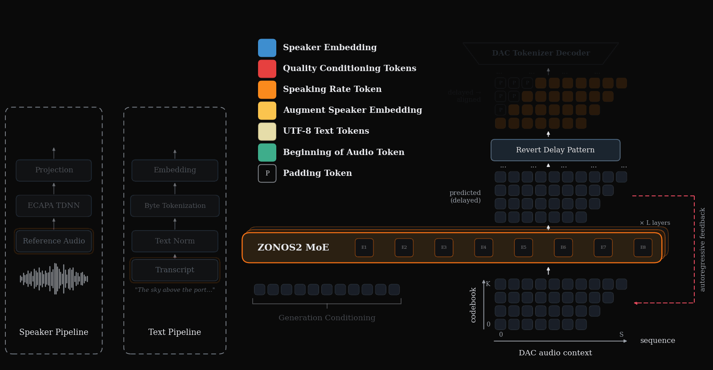

# zonos2.cpp

<p align="center">
  
</p>

<div align="center">
  <a href="https://discord.gg/gTW9JwST8q" target="_blank">
    
  </a>
</div>

---

zonos2.cpp is a standalone [ggml](https://github.com/ggml-org/ggml)/GGUF C++ port of
[ZONOS2](https://huggingface.co/Zyphra/ZONOS2), Zyphra's ~7.6B-param MoE text-to-speech model.
The **entire pipeline** — ECAPA-TDNN speaker encoder, the MoE language-model backbone, and the
DAC-44kHz vocoder — runs as native C++ linking only `libggml` + `gguf`. **No Python, no PyTorch,
no CUDA-only kernels at inference time.** It runs on **CPU, CUDA, Apple Metal, and Vulkan** from
the same GGUF files, in real time on GPU, and quantizes down to **4.9 GB (Q4_K)** with audio
quality within eval noise of F16.

An inference overview can be seen below.

<p align="center">
  
</p>

zonos2.cpp ships a high-performance HTTP server (`zonos2-server`) that mirrors the reference
FastAPI server — low-latency streaming PCM, an OpenAI-compatible `/v1/audio/speech` route,
in-process voice cloning, and a browser UI — plus a CLI (`zonos2-cli`) for offline synthesis.
Every stage is numerically validated against the PyTorch reference — the speaker encoder and DAC
decoder bit-exact, the backbone to cosine ≥ 0.9999.

**For more details and speech samples, check out the [blog](https://www.zyphra.com/our-work/zonos2).**

**A hosted version is available at [cloud.zyphra.com/audio-playground](https://cloud.zyphra.com/audio-playground).**

---

## Quick Start

> **Platform Support**: Linux x64 (CPU / Vulkan), macOS arm64 (Metal), and Windows x64 (Vulkan)
> ship prebuilt. For CUDA (sm_90 / H100 by default), [build from source](#manual--advanced-setup).

### 1. Download & extract

Grab the archive for your OS from the [Releases](../../releases) page (a `.tar.gz`, or a `.zip`
on Windows — extract it anywhere). Each archive is self-contained: the `start-zonos2` launcher,
`zonos2-server` + the `web/` UI, and the `zonos2-cli` / `spk-encoder-cli` / `dac-cli` /
`quantize-cli` tools — no installer, no shared libraries.

> **First run on macOS / Windows:** the release binaries are unsigned (built by CI, with no
> code-signing certificate), so the OS may block them the *first* time you run one. This is
> expected — the warning is about the missing signature, not the binary. Building from source
> avoids it entirely.

<details>
<summary>Clearing the OS security warning on the prebuilt binaries</summary>

- **macOS (Gatekeeper)** — you'll see *"…cannot be opened because the developer cannot be
  verified"* (or *"Apple could not verify … is free of malware"* on Sequoia). macOS flags every
  file in a downloaded archive with a quarantine attribute — including `start-zonos2.command`;
  strip it from the folder you extracted into, then run the tools normally:
  ```bash
  xattr -dr com.apple.quarantine /path/to/extracted-folder
  ```
  Alternatively, after the first blocked launch, allow it via **System Settings → Privacy &
  Security → Open Anyway** (or right-click the `.command` → **Open**). If the double-click stays
  blocked, run it from a terminal instead: `bash start-zonos2.command`.

- **Windows (SmartScreen / Defender)** — *"Windows protected your PC"* appears the first time you
  launch `start-zonos2.bat` or one of the `.exe`s. Click **More info → Run anyway**. To clear the
  block before extracting, unblock the downloaded archive (right-click → **Properties → Unblock →
  OK**, or in PowerShell):
  ```powershell
  Unblock-File .\zonos2-windows-x64-vulkan.zip
  ```
  If Microsoft Defender quarantines the unrecognized `.exe`, restore it from Protection History
  or add a Defender exclusion for the folder. On enterprise machines where PowerShell scripts are
  locked down entirely, launch the server by hand instead — see
  [Manual & advanced setup](#manual--advanced-setup).

- **Linux** — no signing prompt. If a binary won't start, it usually just needs the execute bit:
  ```bash
  chmod +x start-zonos2.sh zonos2-cli zonos2-server
  ```

</details>

### 2. Install ffmpeg (required for voice cloning)

Voice cloning decodes reference audio by shelling out to `ffmpeg` — the server's `--spk`
upload route, `zonos2-cli --clone`, and `spk-encoder-cli --clone` all need it on your `PATH`.
Plain TTS works without it.

```bash
# macOS
brew install ffmpeg
# Debian / Ubuntu
sudo apt install ffmpeg
# Windows
winget install ffmpeg    # or: choco install ffmpeg / scoop install ffmpeg
```

### 3. Run the start script

| OS | Do this |
|---|---|
| Linux | `./start-zonos2.sh` |
| macOS | double-click `start-zonos2.command` (or `./start-zonos2.sh`) |
| Windows | double-click `start-zonos2.bat` |

The first run downloads the models (~7.1 GB — the Q6_K backbone plus the DAC vocoder and speaker
encoder) into `models/` next to the script; downloads resume if interrupted. It then launches
`zonos2-server` and opens the web UI at `http://127.0.0.1:1919/`. Later runs skip straight to
launch. The Vulkan/Metal archives default to GPU, the CPU archive to CPU. Close the window (or
Ctrl-C) to stop the server.

Common knobs (`./start-zonos2.sh --help` / `start-zonos2.bat -Help` lists everything):

| | Linux/macOS | Windows |
|---|---|---|
| Backbone quant (q4_k 4.9 GB · q5_k 5.8 GB · q6_k 6.8 GB · q8_0 8.5 GB · f16 15.3 GB) | `--quant q4_k` | `-Quant q4_k` |
| Force backend | `--cpu` / `--gpu` | `-Cpu` / `-Gpu` |
| Port | `--port 8080` | `-Port 8080` |
| Skip download prompt / browser | `-y`, `--no-browser` | `-Yes`, `-NoBrowser` |
| Extra `zonos2-server` flags | `-- --batch 16` | appended verbatim |

Model dir, download URL, and more can be overridden via `ZONOS2_*` environment variables (see
`--help`). Prefer to launch the server by hand, or want CUDA? See
[Manual & advanced setup](#manual--advanced-setup).

### 4. Generate Speech

**curl:**

```bash
# stream raw float32 PCM @ 44.1 kHz
curl -X POST http://localhost:1919/tts/generate \
  -H "Content-Type: application/json" \
  -d '{"text": "Hello world", "stream": true, "seed": 1}' \
  --output output.pcm

# convert to WAV
ffmpeg -f f32le -ar 44100 -ac 1 -i output.pcm output.wav

# or get a buffered WAV directly
curl -s http://localhost:1919/tts/generate \
  -d '{"text":"Hi.","stream":false,"format":"wav","seed":1}' -o out.wav
```

**Web UI:** Open `http://localhost:1919/` in your browser.

## Desktop App (zonos2-app)

The same server and web UI, packaged as a native window (a [saucer](https://github.com/saucer/saucer)
webview: WebView2 / WKWebView / WebKitGTK). First launch opens a setup page to pick your `.gguf`
files with native file dialogs; the choice is saved (`~/.config/zonos2/app.json`, or the platform
equivalent) and later launches boot straight into the UI. The embedded server binds an ephemeral
`127.0.0.1` port and its whole HTTP API stays reachable while the app runs; closing the window
shuts it down. Release tags ship prebuilt bundles: `zonos2-linux-x64-app.tar.gz`,
`zonos2-macos-arm64-app.zip` (a `Zonos2.app`), and `zonos2-app.exe` inside the Windows
`zonos2-windows-x64-vulkan.zip`.

Building it is opt-in — saucer needs a much newer toolchain than the rest of the project
(CMake ≥ 3.31 and a C++23 compiler: GCC ≥ 14 / Clang ≥ 20 / Xcode ≥ 16.3 / MSVC ≥ 19.44):

```bash
# Linux additionally needs: libgtk-4-dev (>= 4.12, i.e. Ubuntu 24.04+), libwebkitgtk-6.0-dev,
# libadwaita-1-dev, libjson-glib-dev
cmake -B build -DZONOS2_APP=ON
cmake --build build --target zonos2-app

./build/zonos2-app                 # setup page on first run, saved config afterwards
./build/zonos2-app --setup         # reopen the setup page
./build/zonos2-app out/zonos2-q8_0.gguf --dac out/dac.gguf --gpu   # or pass zonos2-server args through
```

## Emotion Control

Emotion control nudges a cloned speaker voice with shipped direction vectors: named sliders
(`happy`, `sad`, `angry`, `surprised`) plus `valence` and `arousal` axes. It requires a speaker
embedding from an uploaded/cached voice or CLI `--speaker` / `--clone`.

```bash
curl -X POST http://localhost:1919/tts/generate \
  -H "Content-Type: application/json" \
  -d '{
        "text": "I cannot believe you did that!",
        "speaker_embedding_id": "spk_...",
        "emotion_enabled": true,
        "emotion_sliders": {"happy": 1.0},
        "accurate_mode": false,
        "emotion_cfg_scale": 1.5,
        "stream": true
      }' \
  --output happy.pcm
```

`GET /tts/capabilities` reports `emotion_enabled`, `emotion_names`, `emotion_axes`, and
`emotion_calibrated`. `emotion_strength` is a multiplier on the loaded calibration when
`calibration.json` is present.

## CLI (offline inference)

You can also synthesize directly from the command line, without starting a server. One command
turns text into a 44.1 kHz WAV:

```bash
zonos2-cli out/zonos2-q8_0.gguf --tts "Hello, world." out.wav \
    --dac out/dac.gguf --gpu --seed 1
```

Clone a voice in-process by pointing `--clone` at any reference audio (needs `ffmpeg` on PATH):

```bash
zonos2-cli out/zonos2-q8_0.gguf --tts "Cloned voice demo." out.wav \
    --dac out/dac.gguf --clone voice.mp3 --spk-encoder out/spk-encoder.gguf --gpu --seed 1
```

CLI emotion example:

```bash
zonos2-cli out/zonos2-q8_0.gguf --tts "That was incredible." out.wav \
    --dac out/dac.gguf --speaker voice.npy --emotion happy=1 \
    --emotion-strength 1 --emotion-cfg-scale 1.5 --gpu --seed 1
```

When `dac.gguf` / `spk-encoder.gguf` sit next to the backbone GGUF (as the start script arranges
in `models/`), `--dac` and `--spk-encoder` are found automatically and can be dropped:

```bash
zonos2-cli models/zonos2-q6_k.gguf --tts "Hello, world." out.wav --gpu --seed 1
```

## Manual & advanced setup

### Download models by hand

The launcher just fetches from [`Zyphra/ZONOS2-GGUF`](https://huggingface.co/Zyphra/ZONOS2-GGUF);
you can do the same with the HF CLI (or plain `curl`):

```bash
hf download Zyphra/ZONOS2-GGUF dac.gguf spk-encoder.gguf --local-dir out
# pick a backbone: Q8_0 is effectively lossless, Q4_K is the smallest that holds quality
hf download Zyphra/ZONOS2-GGUF zonos2-q8_0.gguf --local-dir out   # 8.5 GB
hf download Zyphra/ZONOS2-GGUF zonos2-q4_k.gguf --local-dir out   # 4.9 GB
```

(You can also convert the original checkpoints and make any quant yourself — see
[docs/INTERNALS.md](docs/INTERNALS.md).)

### Launch the server by hand

```bash
zonos2-server out/zonos2-q8_0.gguf --dac out/dac.gguf --spk out/spk-encoder.gguf \
    --host 0.0.0.0 --port 1919 --gpu --tts-default-voices-dir default_voices
```

The server starts on `http://localhost:1919` by default. It loads the backbone + DAC (+ speaker
encoder) once and serves the reference TTS API: streaming float32 PCM, the OpenAI-compatible
`/v1/audio/speech` route, audio-upload voice cloning, cached/default speakers, and SLERP speaker
blending. `--spk` (alias `--spk-encoder`) enables cloning from uploaded reference audio and
default voice audio files; drop `--gpu` for CPU. As with the CLI, `--dac`/`--spk` are
auto-detected when the GGUFs sit next to the backbone. Emotion direction files in
`./emotion_directions/` are autoloaded when present; use `--tts-emotion-directions-dir <dir>` to
point elsewhere or pass an empty directory string to disable emotion controls. Default voices are
scanned from `default_voices/` by default; use `--tts-default-voices-dir <dir>` to point
elsewhere or pass an empty string to disable them. `zonos2-server` with no arguments prints all
options (`--host`, `--batch`, streaming knobs, …).

Text normalization is available through the reference NeMo/Pynini helper when launched with a
Python environment that has `pynini` installed:

```bash
zonos2-server out/zonos2-q8_0.gguf --dac out/dac.gguf --spk out/spk-encoder.gguf \
    --gpu --text-normalizer-python .venv-tts-norm/bin/python
```

Without `--text-normalizer-python`, the server keeps the pure byte-level tokenizer path and reports
`text_normalization_enabled:false`.

### Build from source

```bash
git clone --recurse-submodules https://github.com/Zyphra/zonos2.cpp.git && cd zonos2.cpp

# CPU
cmake -B build -DCMAKE_BUILD_TYPE=Release && cmake --build build -j

# CUDA (H100 = sm_90; pass -DCMAKE_CUDA_ARCHITECTURES=<n> for other GPUs)
cmake -B build-cuda -DGGML_CUDA=ON -DCMAKE_BUILD_TYPE=Release && cmake --build build-cuda -j
```

Vulkan and Metal build the same way (`-DGGML_VULKAN=ON`; Metal is on by default on macOS).

## Under the Hood

zonos2.cpp is a faithful, numerically-validated port. For the full conversion flow, the
quantization ladder (F16 spine + K-quant experts, with WER / SpkSim / UTMOS evals), performance
(H100 and Apple Silicon), the validation harness, and the architecture spec, see
**[docs/INTERNALS.md](docs/INTERNALS.md)**.

## Credits

- [ggml](https://github.com/ggml-org/ggml) — the tensor library / GGUF format.
- [Zyphra/ZONOS2](https://huggingface.co/Zyphra/ZONOS2) — the original model and PyTorch reference
  this port mirrors and is validated against.
- [Descript Audio Codec](https://github.com/descriptinc/descript-audio-codec) — the DAC vocoder.

## Citation

If you find this model useful in an academic context please cite as:

```
@misc{zyphra2025zonos,
  title     = {Zonos V2 Technical Report},
  author    = {Gabriel Clark, Sofian Mejjoute, Mohamed Osman, George Close, Beren Millidge},
  year      = {2026},
}
```
